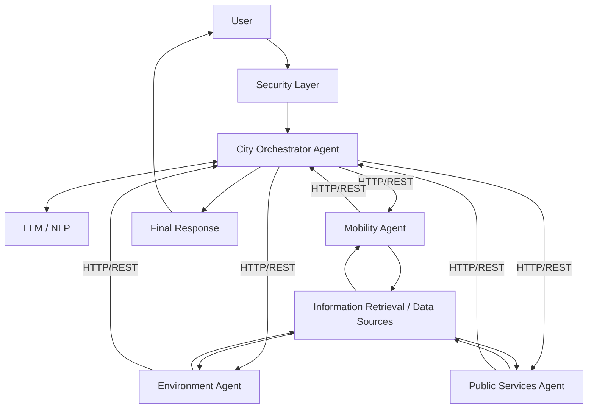

# Smart City AI

## Agentic Citizen Assistance System

> **Status:** Initial project setup — implementation not started. Everything described below is **proposed or planned**; nothing has been implemented yet.

### Project Overview

This is a university project for the **Information Retrieval and Web Analytics (IT 3041)** module.

The **proposed** system is an Agentic AI-based Smart City citizen assistance system. It aims to provide a unified conversational interface for accessing information across **transportation**, **environmental conditions**, and **public services**.

### Problem Statement

Smart City information can be spread across multiple sources, such as separate websites, apps, and documents. This can make it difficult for citizens to efficiently find the information they need. This project sets out to address that problem by exploring a single assistant that can find and combine information from several domains.

### Proposed Solution

We propose a **multi-agent architecture** made up of four agents:

- A **City Orchestrator Agent** receives the citizen's request, decides which specialist agent(s) are needed, and combines their results into one final response.
- Three **specialist agents** (Mobility, Environment, Public Services) each focus on one domain and retrieve relevant information from their own data sources.

The agents are planned to communicate over **HTTP/REST**.

### Agents

All responsibilities below are **planned**.

#### City Orchestrator Agent
- Receive user requests
- Understand the request
- Determine which specialist agent(s) are required
- Coordinate the specialist agents
- Combine their results
- Produce the final response

#### Mobility Agent
- Traffic
- Public transport
- Routes
- Parking
- EV charging

#### Environment Agent
- Air quality
- Pollution
- Weather
- Waste
- Environmental conditions

#### Public Services Agent
- Hospitals
- Police stations
- Fire stations
- Government services
- Emergency information
- Citizen complaints

### Planned Technology Stack

| Component | Planned Technology |
|---|---|
| LLM | Gemini 2.5 Flash |
| LLM Framework | LangChain |
| Backend | Python + FastAPI |
| Frontend | React + TypeScript |
| Agent Communication | HTTP/REST |
| NLP | NER + Summarization |
| Information Retrieval | BM25 + Semantic Retrieval / RAG |
| Database | To be finalized |
| Security | JWT + Input Validation + Authorization + HTTPS |

These are **planned technologies** and may be refined during implementation.

### Information Retrieval Strategy

A hybrid data strategy is **planned**:

- **Structured seed data** for initial development
- **Documents** for retrieval / RAG
- **APIs** for real-time information where appropriate

None of this has been implemented yet.

### Planned System Architecture

### Responsible AI

The following areas are **planned** to be considered; none have been implemented yet.

- **Fairness** – avoid biased or unequal answers across areas and user groups.
- **Transparency** – make clear that users are talking to an AI and where information comes from.
- **Explainability** – show which agents and sources contributed to an answer.
- **Privacy** – minimise and protect any user data collected.
- **Security** – protect against unauthorised access and malicious input.
- **Hallucination / reliability** – ground answers in retrieved data and flag uncertainty.
- **Potential misuse** – consider how the system could be abused and how to limit it.
- **Smart-city-specific risks** – e.g. outdated emergency information, or over-reliance on the assistant in urgent situations.

### Commercialization

The project will investigate potential:

- Target users
- Target organizations / customers
- Pricing model
- Deployment model

No pricing has been decided.

### Project Status

**Initial project setup — implementation not started.**

### Team

- Team Leader: Binada Pasandul
- Member 2: [To be added]
- Member 3: [To be added]
- Member 4: [To be added]

### Future Development Phases

1. Project setup
2. Backend foundation
3. Data and seed datasets
4. Individual agents
5. Information Retrieval
6. NLP
7. LLM integration
8. Orchestrator
9. HTTP/REST agent communication
10. Security
11. Frontend
12. Web analytics
13. Responsible AI testing
14. System evaluation
15. Deployment
16. Documentation and final submission
