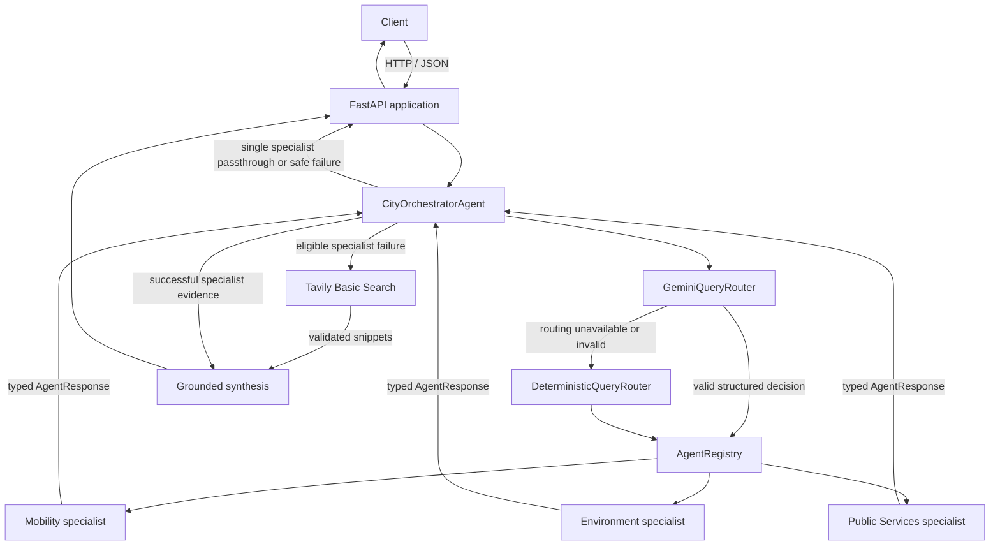

# Smart City AI

## Agentic Citizen Assistance System

> **Status:** Backend orchestration, grounded synthesis, chat API, API security, controlled web-search fallback, and PostgreSQL-backed account registration/login are implemented. Real specialist integrations and frontend remain future work.

### Project Overview

This university project for **Information Retrieval and Web Analytics (IT 3041)** explores a citizen assistance system for transportation, environmental conditions, and public services.

The backend currently provides a FastAPI application and an in-process multi-agent orchestration foundation. Gemini routes and synthesizes supplied evidence; fake specialists are used only in tests and verification. Optional Tavily fallback can retrieve live search snippets, while real specialist data integrations and a frontend remain future work.

### Current Architecture

The backend is **one FastAPI application**. The client communicates with FastAPI over HTTP/JSON. Internally, agents communicate through typed Python contracts and asynchronous in-process method calls. They are not separate services.



Gemini routes requests and can synthesize the final answer from supplied evidence; it does not independently retrieve city facts. The Orchestrator validates routing decisions, executes registered specialists, and uses Tavily Basic Search only after eligible specialist failures when web search is enabled. Search results supplement synthesis as untrusted evidence. Deterministic routing and synthesis remain available when Gemini is unavailable.

### Agent Responsibilities

The routing categories currently supported are:

- **Mobility:** traffic, public transport, routes, parking, EV charging, and transport conditions.
- **Environment:** weather, air quality, pollution, waste, and environmental conditions.
- **Public Services:** hospitals, police, fire and emergency services, government services, and citizen complaints.

The shared protocol includes `AgentRequest`, `AgentResponse`, `AgentSource`, stable error codes, an abstract `BaseAgent`, and `AgentRegistry`. Agent names are machine-readable: `mobility`, `environment`, `public_services`, and `orchestrator`.

Concrete Mobility, Environment, and Public Services agents are not implemented yet. Fake agents are used in tests and verification to exercise orchestration without claiming real data retrieval.

### Implemented Technology

| Area | Current implementation |
|---|---|
| Backend | Python, FastAPI, Uvicorn |
| Configuration | Pydantic Settings |
| Agent contracts | Pydantic models and Python abstract base class |
| Agent communication | Async in-process calls using typed Python objects |
| Orchestration | City orchestrator with single- or multi-agent routing/execution |
| Intelligent routing | Official Google Gen AI Python SDK (`google-genai`), structured routing output |
| Gemini model | Configurable `GEMINI_MODEL`; default `gemini-3.5-flash-lite` |
| Routing fallback | Deterministic keyword router |
| Chat API | `POST /api/v1/chat`; `GET /api/v1/health` remains public |
| API security | Optional JWT verification, bounded input/context, security headers, and in-memory chat rate limiting |
| Web fallback | Optional Tavily Basic Search through `httpx`, validated HTTPS snippets, and bounded one-call fallback |
| Tests | pytest; normal test suite is offline and does not require Gemini credentials |

LangChain and LangGraph are not used. No internal HTTP, MCP, A2A, sockets, or message queues are used for agent communication.

### Configuration

Configuration is loaded by the shared application settings from environment variables and the backend `.env` file when present. The repository template is [`backend/.env.example`](backend/.env.example); copy it to `backend/.env` for local configuration and set credentials there. Keep `.env` private and never commit API keys.

Relevant settings include:

| Variable | Purpose |
|---|---|
| `GEMINI_API_KEY` | Google Gen AI API credential; not required for application startup or offline tests |
| `GEMINI_MODEL` | Gemini routing model; defaults to `gemini-3.5-flash-lite` |
| `AUTH_ENABLED` | Enables JWT verification for chat when `true`; defaults to `false` for local development |
| `JWT_SECRET` | HS256 verification secret; at least 32 characters and no obvious placeholder when auth is enabled |
| `JWT_ALGORITHM`, `JWT_ISSUER`, `JWT_AUDIENCE` | JWT verification policy; only HS256 is allowed |
| `CHAT_MAX_MESSAGE_LENGTH` | Maximum chat message size; default 5000 characters |
| `CHAT_RATE_LIMIT_REQUESTS`, `CHAT_RATE_LIMIT_WINDOW_SECONDS` | Per-client or per-subject chat request window; defaults to 20 per 60 seconds |
| `AGENT_EXECUTION_TIMEOUT_SECONDS` | Per-agent execution timeout |
| `APP_NAME`, `APP_ENV`, `API_V1_PREFIX`, `LOG_LEVEL` | Application metadata, API prefix, and logging |
| `CORS_ORIGINS` | Configured browser origins |
| `DATABASE_URL` | PostgreSQL async SQLAlchemy connection used by account registration and login |
| `TEST_DATABASE_URL` | Dedicated disposable PostgreSQL database URL used only by the opt-in PostgreSQL integration suite |
| `JWT_ACCESS_TOKEN_EXPIRE_MINUTES` | Login-issued access token lifetime; defaults to 60 minutes |
| `AUTH_RATE_LIMIT_REQUESTS`, `AUTH_RATE_LIMIT_WINDOW_SECONDS` | Per-process register/login rate limit; defaults to 10 requests per 60 seconds |
| `WEB_SEARCH_ENABLED` | Enables controlled fallback search; defaults to `false` |
| `WEB_SEARCH_PROVIDER`, `TAVILY_API_KEY` | Tavily is the current provider; a usable key is required only when search is enabled |
| `WEB_SEARCH_TIMEOUT_SECONDS`, `WEB_SEARCH_MAX_RESULTS`, `WEB_SEARCH_QUERY_MAX_LENGTH` | Search time, result count, and query length limits; defaults to 8 seconds, 5 results, and 500 characters |
| `WEB_SEARCH_ON_PARTIAL_FAILURE` | Allows search to supplement available specialist evidence after another specialist fails; defaults to `true` |

Account registration and login are available at `POST /api/v1/auth/register` and `POST /api/v1/auth/login`. They require a reachable PostgreSQL database configured through `DATABASE_URL`; the application can start without a database URL, but these endpoints return a safe service-unavailable response until it is configured. Registration stores only an Argon2id password hash. Emails are trimmed and lowercased before storage and lookup. Login issues an access-only JWT with a configurable lifetime; the token subject is the user's UUID.

When `AUTH_ENABLED=true`, `POST /api/v1/chat` requires a valid Bearer JWT with `exp`, `sub`, configured issuer, and audience. `GET /api/v1/health` and registration/login stay public. Set a strong `JWT_SECRET` (at least 32 characters), issuer, and audience before enabling authentication. The in-memory auth and chat rate limits apply per process. Use HTTPS/TLS in deployment. Refresh tokens, password reset, email verification, and roles are not implemented.

The in-memory rate limiter is for development and a single application process only; it is not shared across workers or servers. Local development uses HTTP. Deployed traffic must use HTTPS/TLS, normally terminated by the hosting platform or reverse proxy. JWT signing does not encrypt traffic.

Web search is disabled by default. When enabled, it runs at most once after a routed specialist fails or times out; complete specialist results, unsupported requests, and clarification requests do not trigger it. The validated user query text (up to the configured length) is sent to Tavily when fallback runs. JWTs, request IDs, and context are not added to that query. Only Tavily Search snippets are consumed; result pages are never fetched, extracted, or crawled. Web snippets remain untrusted external evidence, and the current boundary does not claim full protection against indirect prompt injection. Tavily availability, quotas, and pricing are external to this application.

### Run the Backend

From the `backend/` directory, install the listed dependencies in your virtual environment and start the development server:

```powershell
python -m pip install -r requirements.txt
python -m uvicorn app.main:app --reload
```

The health endpoint is `GET http://127.0.0.1:8000/api/v1/health`; chat requests use `POST http://127.0.0.1:8000/api/v1/chat`. Copy `.env.example` to `.env` and set `DATABASE_URL` to a local PostgreSQL database. The example URL contains only a placeholder password. Apply schema migrations from `backend/` before using registration or login:

```powershell
python -m alembic upgrade head
```

Registration accepts an email, a password of 10–128 characters, and an optional display name. Login returns a Bearer access token. Set a strong `JWT_SECRET`, issuer, audience, and `AUTH_ENABLED=true` before requiring chat authentication outside local development. Never commit `.env` or place real credentials in `.env.example`.

Run the automated tests from `backend/`:

```powershell
python -m pytest
```

The PostgreSQL integration suite is separate from normal offline pytest. Provision a dedicated disposable database named `smart_city_ai_test`, set `TEST_DATABASE_URL` to its async PostgreSQL URL, then run `python -m pytest postgres_tests -m postgres -v`. These tests verify the configured database name before cleaning test records; never point this URL at a development or production database.

The unit tests use mocks/fake agents and do not make Gemini API calls. To explicitly run the developer live verification, configure `GEMINI_API_KEY` and invoke:

```powershell
python -m scripts.verify_gemini_routing
```

This live verification sends requests to Gemini and exercises structured single-agent routing, multi-agent routing, fake-agent orchestration, and deterministic fallback. Its Gemini results must be distinguished from successful fallback results.

### Current Scope and Future Work

Implemented phases:

1. **Phase 0 — Shared backend foundation:** FastAPI application, settings, logging, CORS, health endpoint, and pytest setup.
2. **Phase 1 — Agent protocol:** typed request/response/source/error contracts, `BaseAgent`, and `AgentRegistry`.
3. **Phase 2A — Deterministic routing:** keyword-based classification and registry-based specialist dispatch.
4. **Phase 2B — Gemini routing:** structured Gemini classification, clarification support, and deterministic fallback.
5. **Phase 3A — Multi-agent orchestration:** multiple specialist selection, concurrent execution, timeouts, and partial-failure reporting.
6. **Phase 3B — Grounded synthesis:** combines successful specialist evidence and falls back deterministically.
7. **Phase 4 — Chat API:** validates public requests, maps safe responses, and exposes the shared Orchestrator through FastAPI.
8. **Phase 5 — Security foundation:** optional JWT verification, input/context limits, prompt/data separation, CORS restrictions, response headers, and per-process rate limiting.
9. **Phase 6 — Controlled web-search fallback:** optional Tavily Basic Search after eligible specialist failures, validated snippets and sources, and grounded synthesis with deterministic fallback.
10. **Phase 6.5 — User persistence and authentication:** async SQLAlchemy/PostgreSQL user storage, Alembic migrations, Argon2id password hashing, public registration/login, and login-issued access JWTs.

Not implemented yet: real specialist data retrieval, live traffic/weather/maps/public-service APIs, frontend, RAG/vector search, NLP/NER, refresh tokens, password reset, email verification, social login, roles/RBAC database, distributed rate limiting, and deployment. PostgreSQL is required for DB-backed registration/login; normal startup and offline tests do not require a database URL. In particular, successful orchestration with fake agents is an architecture verification, not evidence that the system currently returns verified city facts.

### Responsible AI

Responsible AI remains a project goal. Source attribution, privacy safeguards, fairness evaluation, and safe handling of urgent or stale public-service information need to be implemented and evaluated as real data sources and user-facing behavior are added. The current routing foundation should not be treated as having completed those safeguards.

### Commercialization

The project may investigate target users, organizations, pricing, and deployment options. No pricing or deployment model has been decided.

### Team

- Team Leader: Binada Pasandul
- Member 2: [To be added]
- Member 3: [To be added]
- Member 4: [To be added]
