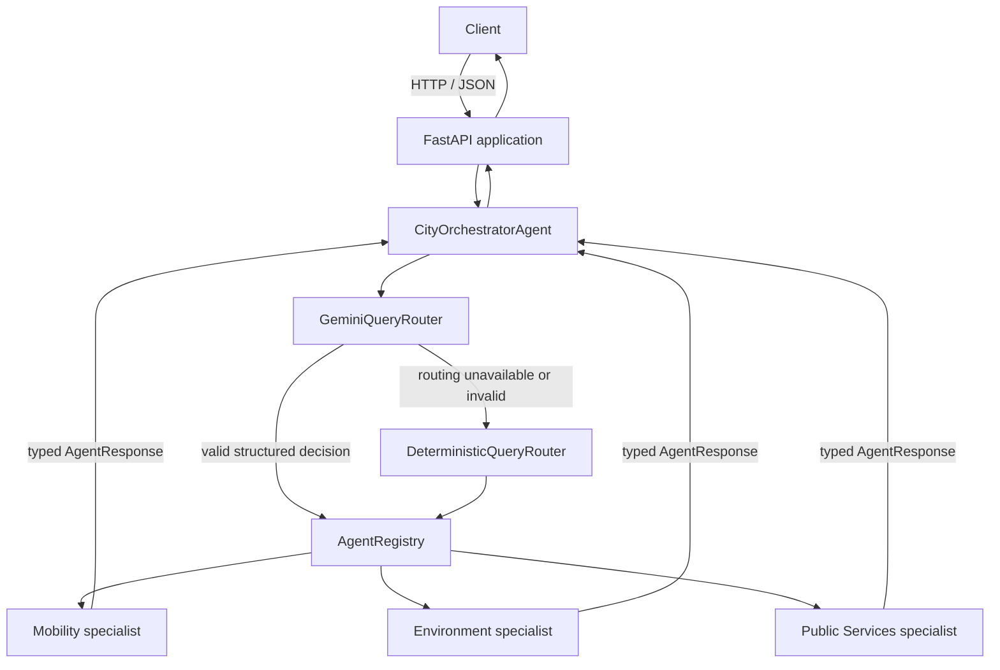

# Smart City AI

## Agentic Citizen Assistance System

> **Status:** Backend foundation, shared agent protocol, and orchestration through Phase 3A are implemented. Specialist agent integrations and final answer synthesis are still future work.

### Project Overview

This university project for **Information Retrieval and Web Analytics (IT 3041)** explores a citizen assistance system for transportation, environmental conditions, and public services.

The backend currently provides a FastAPI application and an in-process multi-agent orchestration foundation. At this stage, Gemini classifies and routes requests; test-only fake specialists demonstrate execution. The system does not yet provide live city information or a user-facing chat endpoint.

### Current Architecture

The backend is **one FastAPI application**. The client communicates with FastAPI over HTTP/JSON. Internally, agents communicate through typed Python contracts and asynchronous in-process method calls. They are not separate services.



Gemini is used **only for routing**. It does not produce the final city answer. The Orchestrator validates the structured routing decision, resolves selected agents through the registry, and coordinates their execution. When Gemini is unavailable or returns invalid output, deterministic keyword routing remains available. Multi-agent selections execute concurrently in-process and report complete, partial, or failed execution status.

### Agent Responsibilities

The routing categories currently supported are:

- **Mobility:** traffic, public transport, routes, parking, EV charging, and transport conditions.
- **Environment:** weather, air quality, pollution, waste, and environmental conditions.
- **Public Services:** hospitals, police, fire and emergency services, government services, and citizen complaints.

The shared protocol includes `AgentRequest`, `AgentResponse`, `AgentSource`, stable error codes, an abstract `BaseAgent`, and `AgentRegistry`. Agent names are machine-readable: `mobility`, `environment`, `public_services`, and `orchestrator`.

Concrete Mobility, Environment, and Public Services agents are not implemented yet. Fake agents are used in tests and verification to exercise orchestration without claiming real data retrieval.

### Implemented Technology

| Area | Current implementation |
|---|---|
| Backend | Python, FastAPI, Uvicorn |
| Configuration | Pydantic Settings |
| Agent contracts | Pydantic models and Python abstract base class |
| Agent communication | Async in-process calls using typed Python objects |
| Orchestration | City orchestrator with single- or multi-agent routing/execution |
| Intelligent routing | Official Google Gen AI Python SDK (`google-genai`), structured routing output |
| Gemini model | Configurable `GEMINI_MODEL`; default `gemini-3.5-flash-lite` |
| Routing fallback | Deterministic keyword router |
| Tests | pytest; normal test suite is offline and does not require a Gemini key |

LangChain and LangGraph are not used. No internal HTTP, MCP, A2A, sockets, or message queues are used for agent communication.

### Configuration

Configuration is loaded by the shared application settings from environment variables and the backend `.env` file when present. The repository template is [`backend/.env.example`](backend/.env.example); copy it to `backend/.env` for local configuration and set credentials there. Keep `.env` private and never commit API keys.

Relevant settings include:

| Variable | Purpose |
|---|---|
| `GEMINI_API_KEY` | Google Gen AI API credential; not required for application startup or offline tests |
| `GEMINI_MODEL` | Gemini routing model; defaults to `gemini-3.5-flash-lite` |
| `AGENT_EXECUTION_TIMEOUT_SECONDS` | Per-agent execution timeout |
| `APP_NAME`, `APP_ENV`, `API_V1_PREFIX`, `LOG_LEVEL` | Application metadata, API prefix, and logging |
| `CORS_ORIGINS` | Configured browser origins |
| `DATABASE_URL`, `JWT_SECRET`, `JWT_ALGORITHM` | Reserved configuration values; database and authentication behavior are not implemented |

### Run the Backend

From the `backend/` directory, install the listed dependencies in your virtual environment and start the development server:

```powershell
python -m pip install -r requirements.txt
python -m uvicorn app.main:app --reload
```

The application health endpoint is `GET http://127.0.0.1:8000/api/v1/health`. There is not yet a public chat or agent endpoint.

Run the automated tests from `backend/`:

```powershell
python -m pytest
```

The unit tests use mocks/fake agents and do not make Gemini API calls. To explicitly run the developer live verification, configure `GEMINI_API_KEY` and invoke:

```powershell
python -m scripts.verify_gemini_routing
```

This live verification sends requests to Gemini and exercises structured single-agent routing, multi-agent routing, fake-agent orchestration, and deterministic fallback. Its Gemini results must be distinguished from successful fallback results.

### Current Scope and Future Work

Implemented phases:

1. **Phase 0 — Shared backend foundation:** FastAPI application, settings, logging, CORS, health endpoint, and pytest setup.
2. **Phase 1 — Agent protocol:** typed request/response/source/error contracts, `BaseAgent`, and `AgentRegistry`.
3. **Phase 2A — Deterministic routing:** keyword-based classification and registry-based specialist dispatch.
4. **Phase 2B — Gemini routing:** structured Gemini classification, clarification support, and deterministic fallback.
5. **Phase 3A — Multi-agent orchestration:** multiple specialist selection, concurrent execution, timeouts, and partial-failure reporting.

Not implemented yet: real specialist data retrieval, live traffic/weather/maps/public-service APIs, final answer synthesis, chat API endpoint, frontend, database, RAG/vector search, NLP/NER, authentication/authorization, and deployment. In particular, successful orchestration with fake agents is an architecture verification, not evidence that the system currently returns verified city facts.

### Responsible AI

Responsible AI remains a project goal. Source attribution, privacy safeguards, fairness evaluation, and safe handling of urgent or stale public-service information need to be implemented and evaluated as real data sources and user-facing behavior are added. The current routing foundation should not be treated as having completed those safeguards.

### Commercialization

The project may investigate target users, organizations, pricing, and deployment options. No pricing or deployment model has been decided.

### Team

- Team Leader: Binada Pasandul
- Member 2: [To be added]
- Member 3: [To be added]
- Member 4: [To be added]
